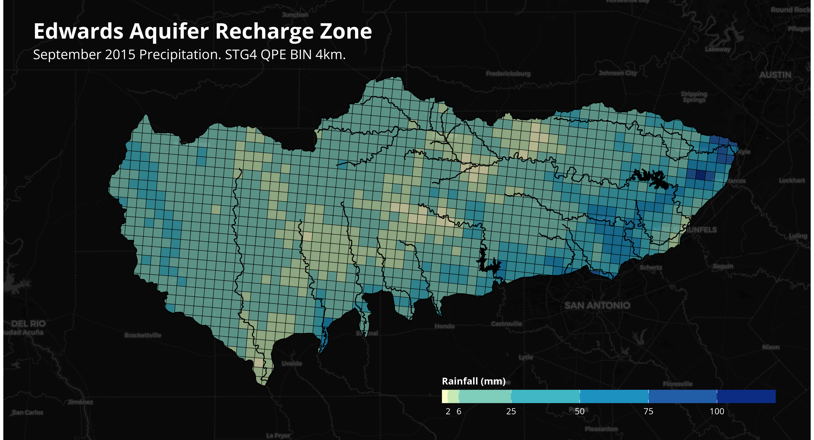
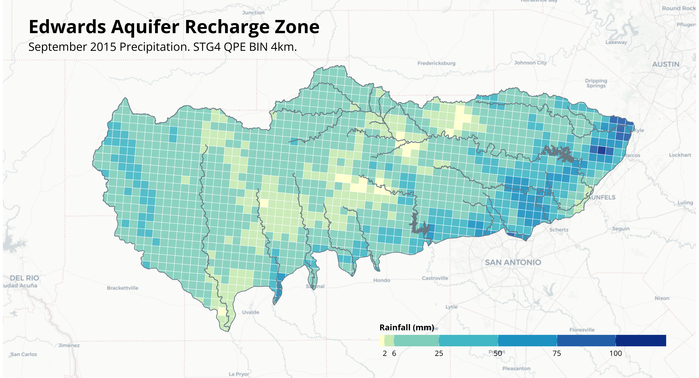
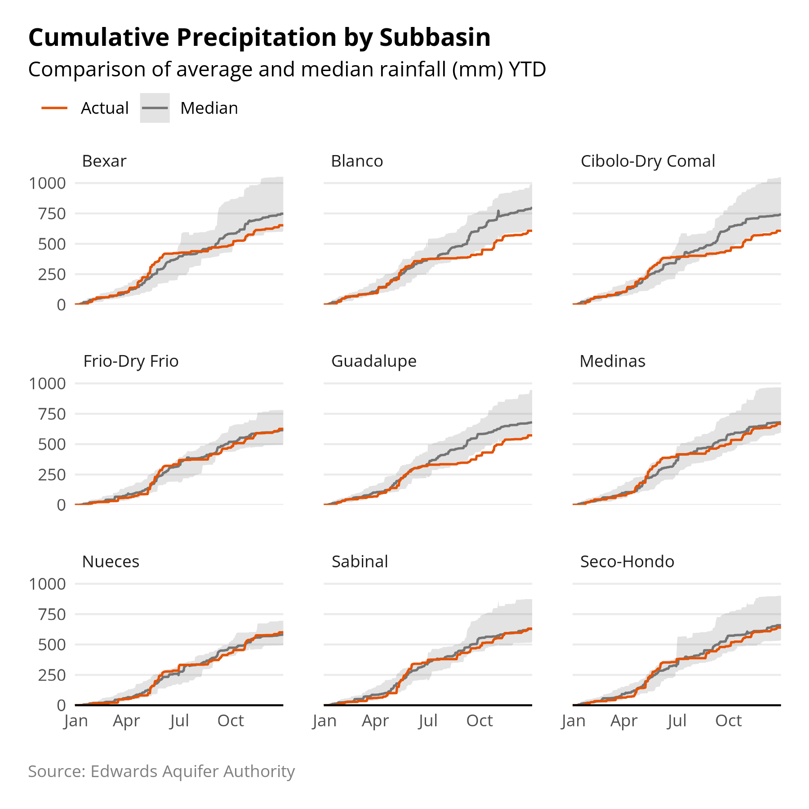
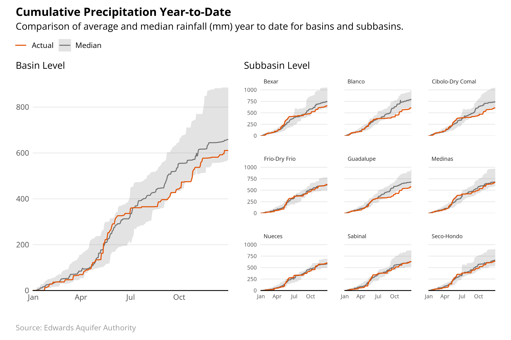

# EAA Project

## Directory Structure

Repository directories are comprised of 4 main folders: `assets`, `data`, `R`, and `outputs`.

The assets folder includes branded assets, e.g. logos, as well as branded style guidelines. It also includes a powerpoint template that is used in conjunction with the Quarto script.

Data files are stored in the `data` folder, this includes original shape and parquet files from EAA. A subfolder, `processed`, includes data files that are created by using preprocessing scripts.

All R code is stored in the R folder, this includes data preprocessing scripts (`preprocessing.R`), functions for plotting, branded parameters, and a Quarto file to generate powerpoints.

Lastly, the outputs folder contains all final plots (pngs) as well as the final powerpoint output generated by the Quarto qmd file.

## Functions

`plot_ribbon` (see [`function_ribbon.R`](./R/function_ribbon.R)): generates a regular hyetograph (ribbon graph with median and average rainfall). parameters include `data`, which accepts the cumulative_subbasin.csv file. It must include `select_basin` to subset by specific basin. Additional parameters are included to adjust the `title`, `subtitle`, and `caption` as well as certain color aesthetics (e.g. `pal_avg` and `pal_median` to change line colors).

`plot_ribbon_facet` (see [`function_ribbon.R`](./R/function_ribbon.R)): similar to `plot_ribbon`, generates a facetted ggplot graph (hyetograph). All parameters are the same as `plot_ribbon`, the only difference is the `select_basin` parameter is replaced with `basins`, and accepts a list of values e.g. `basins = c('Bexar', 'Blanco', 'Medinas')`.

`plot_bin_map` (see `function_bin_map.R`): plots EAA Recharge Zone with 4km bins showing rainfall in mm. function requires data inputs, i.e. for param `map_rain` as well as shape files (`map_lakes`, `map_streams`). The `map_rain` data set must include sum_rain as a variable. Users can change the base layer map using `map_type` (e.g. cartolight, cartodark) and the bin color palette using a colorbrewer default (e.g. YlGnBu). There are additional styling parameters to change colors of fonts (e.g. `pal_title`), outlines, and water, as well as font family.

## Plot Outputs

Example of an output using `plot_bin_map` using dark mode styling.

Example of an output using `plot_bin_map` using light mode styling.

Example of an output using `plot_ribbon`.

Example of an output using `plot_ribbon_facet`.

Example combining both plots using `patchwork`

